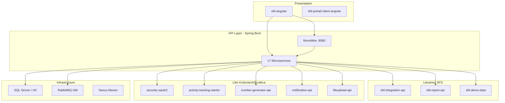

# ERP-SFD — Architecture technique

> NEXORA — ERP microfinance UEMOA. Voir aussi [INDEX.md](../INDEX.md).

---

## Modes d'exécution

### Microservices (production)

Chaque service = JAR Spring Boot indépendant, port dédié (4594–4611), context `/api/{module}`.

### Monolithe (développement local)

[`sfd-erp-monolith`](../sfd-erp-monolith/) agrège 17 thin JARs sur **port 8080**.

```
mvn clean install -DskipTests -Dspring-boot.repackage.skip=true  # par service
cd sfd-erp-monolith && ./mvnw spring-boot:run -DskipTests
```

- `@ComponentScan("com.synapsesit.sfd")` avec exclusions par service
- `MonolithAppConfig` centralise `@Import` des libs externes + SetupLoaders
- `FullyQualifiedAnnotationBeanNameGenerator` évite collisions de beans

---

## Couches logicielles



---

## Intégration inter-services

### sfd-integration-api

Clients REST synchrones avec cache 5 min + fallback UEMOA :

| Facade | Cible | Port |
|--------|-------|------|
| `PreferenceService` | sfd-commun-service | 4597 |
| `ClientService` | sfd-client-service | 4598 |
| `ComptabiliteService` | sfd-comptabilite-service | 4595 |

Config : `app.preference.base-url`, `app.client.base-url`, `app.comptabilite.base-url`

### Filtrage agence

Header `X-Agence-Code` → `AgenceContextFilter` → `ThreadLocal` → filtrage repository/service.

Exclus du filtre : plan comptable, exercices, journaux, coupures, produits épargne référentiels.

---

## Messaging RabbitMQ

| Élément | Valeur |
|---------|--------|
| Exchange | `sfd.operations` (Topic) |
| VHost | `/sfd` |
| Queues | `q.{module}.operations` (une queue par consommateur — fan-out) |
| DLQ | `x-dead-letter-exchange: sfd.dlx` |
| Converter | Jackson2JsonMessageConverter, `trustedPackages=*` |

**Règle** : `@Lazy(false)` sur tous `@RabbitListener`.

### Flux typiques

- **Caisse → Comptabilité** : `TransfertBancaireEvent` → `OperationBancaire`
- **Modules métier → Comptabilité** : `LignesComptablesEvent` → écritures SYSCOHADA
- **Opérations cross-module** : dépôt/retrait espèces, déblocage crédit

---

## Comptabilisation événementielle

```
Opération métier → SchemaComptableOperation → LignesComptablesPublisher → RabbitMQ → Comptabilité
```

- Date opération = journée comptable ouverte (`ComptabiliteService.getDateJourneeComptableOuverte()`)
- Comptes via `SchemaComptable` — jamais hardcoder numéros de compte
- Auxiliaires clients : préfixe `CLI-` + code client

---

## Sécurité

- JWT partagé : `app.auth.tokenSecret` identique sur tous les services
- Rôles : `ROLE_{DOMAIN}_{ENTITY}_{ACTION}` + fallback `ROLE_ADMIN`
- `@PreAuthorize` sur chaque endpoint REST
- Frontend : `*appHasRole`, `RoleGuard` sur routes lazy-loaded

Lib : [security-oauth2](../../Java/commons/security-oauth2/CLAUDE.md)

---

## Persistance

| Env | Base |
|-----|------|
| Local sans profil | SQL Server `localhost:1433;databaseName=sfd` ou H2 selon service |
| Profil `dev` | `sql-server-dev` (distant — **interdit en local**) |
| Migrations | Liquibase (`liquibase-core` obligatoire dans pom.xml) |

Jackson : `spring.jackson.serialization.write-dates-as-timestamps: false` (ISO dates).

---

## Reporting

- **sfd-report-api** : générateurs PDF (iText), Excel (POI), CSV
- Pattern par service : `{module}/rapport/` (controller, service, mapper)
- Formats : `FormatExport.PDF | EXCEL | CSV | XML`
- Groupage : param `groupePar` + tri préalable côté service

---

## Frontend Angular (sfd-angular)

- Angular 19, NgRx 18, Bootstrap 5.3 / Velzon
- NgModules (`standalone: false`)
- Proxy dev : chemins `/api/*` → microservices ou monolithe
- E2E : Playwright dans `e2e/crud/`, patterns assertHasRows + interceptApiErrors

---

## Mobile

| Projet | Stack | Backend |
|--------|-------|---------|
| sfd-agent-mobile-flutter | Flutter | sfd-agent-mobile-service :4610 |
| sfd-mobile/sfd_shared | Package partagé | — |
| sfd-portail-client-angular | Angular | sfd-portail-client-service :4611 |

---

## CI/CD

- **Production** : Jenkins VPS (source opérationnelle)
- **GitHub** : workflows réutilisables `Peterery21/sfd-github-workflows` (souvent disabled localement)
- **SonarQube** : `sonarqube.evolticatechnologies.com` — Quality Gate sur new code

---

*Voir [DEPENDENCIES.md](DEPENDENCIES.md) pour la matrice Maven détaillée.*
